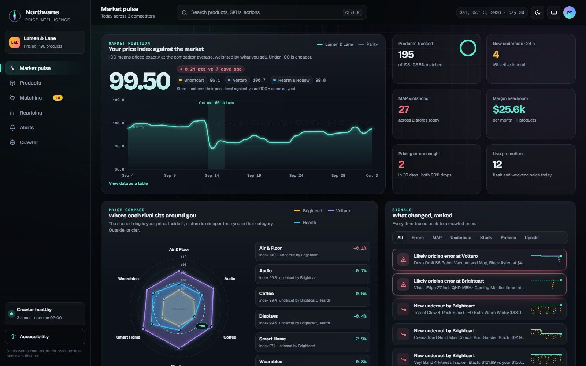
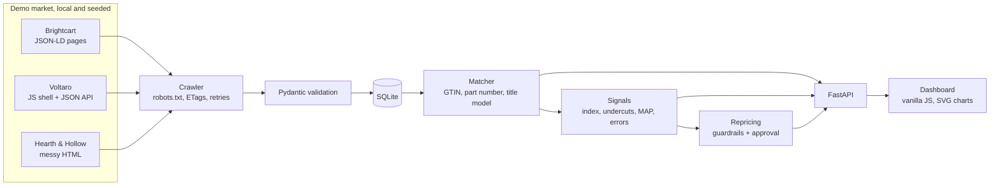

# Northvane

Price intelligence for an online store. It crawls three competitor stores every day, works out which of
their listings is which of our products, and flags what changed: undercuts, MAP breaches, flash sales,
stock-outs and pricing mistakes.

The market is a demo. The three stores run locally and their brands, products and prices are generated
from a seed, so every match and every alert can be checked against a known answer. The crawler, matcher,
signals and dashboard are real code.

**Product matching F1 0.989, against 0.706 for plain fuzzy title matching.**



```bash
pip install -r requirements.txt
python run.py                           # ~45 s, regenerates every number below
uvicorn northvane.api:app --port 8800   # dashboard at http://localhost:8800
pytest -q                               # 53 tests
```

## How it fits together



Each store is a different scraping problem on purpose. Brightcart puts JSON-LD on its product pages,
Voltaro is an empty JavaScript shell with a rate-limited JSON API behind it, and Hearth & Hollow is
hand-written HTML with random 503s.

Matching goes cheapest evidence first: same barcode, then same part number, then a title model inside the
same brand with an attribute check, so a different colour or capacity can't sneak through. Each store is
then matched one-to-one with the Hungarian algorithm.

## Results

30 days of crawling, from `results/summary.txt`:

| | |
| --- | --- |
| Requests | 6,189 in 36.5 s, 0 failed |
| Unchanged pages skipped with a 304 | 4,384 |
| Retried after a 429 or 503 | 124 |
| Links disallowed by robots.txt, never requested | 4,500 |
| Matching precision / recall | 100% / 97.8% |
| Fuzzy title baseline | F1 0.706, 55 wrong matches |
| Planted pricing errors caught | 2 of 2 (both 90% drops) |
| Brightcart following our price cuts | 41 of 49, median lag 1 day |

Repricing only suggests. Every price stays inside a margin floor, the MAP floor and a max daily move, and
nothing changes without approval.

## Limits

Recall is 97.8%, not 100%. The 10 pairs it is unsure about go to a review queue for a person instead of
being guessed. And the stores are generated, so a real one will be messier. It has not been pointed at a
live store.

MIT licence. Demo data only, nothing here is real pricing data.
